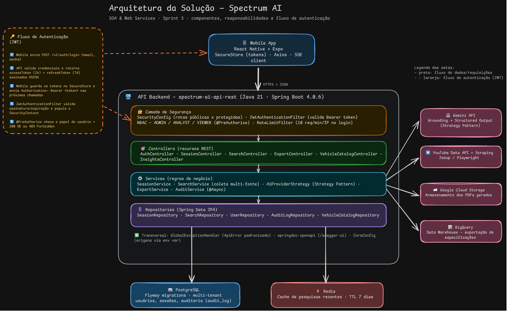

# Spectrum AI — Backend

API REST para a plataforma de análise competitiva automotiva Spectrum AI.

Construída com **Spring Boot 4**, **Java 21**, **PostgreSQL 16** e integração com **Google Gemini**.

---

## Integrantes

Caio Alexandre dos Santos - RM: 558460

Leandro do Nascimento Souza - RM: 558893

Rafael de Mônaco Maniezo - RM: 556079

Vinicius Rozas Pannuci de Paula Cont - RM: 555338

---

## Sumário

- [Quick start (TL;DR)](#quick-start-tldr)
- [Arquitetura](#arquitetura)
- [Tecnologias](#tecnologias)
- [Pré-requisitos](#pré-requisitos)
- [Configuração do ambiente](#configuração-do-ambiente)
- [Rodando a aplicação](#rodando-a-aplicação)
- [Testando a API](#testando-a-api)
- [Endpoints principais](#endpoints-principais)
- [Perfis de execução](#perfis-de-execução)
- [Deploy em produção](#deploy-em-produção)
- [Comandos úteis](#comandos-úteis)
- [Estrutura de módulos](#estrutura-de-módulos)
- [Migrations](#migrations)
- [Troubleshooting](#troubleshooting)
- [Documentação adicional](#documentação-adicional)

---

## Quick start (TL;DR)

Com Docker Desktop instalado:

```bash
git clone <url-do-repositorio>
cd spectrum-ai-api-rest
cp .env.example .env
# edite .env e preencha JWT_SECRET, GEMINI_API_KEY e FIPE_API_TOKEN
docker compose up --build
```

Pronto. Abra http://localhost:8080/swagger-ui.html para explorar a API.

---

## Arquitetura



O app mobile fala com a API só por HTTPS/JSON. Dentro da API, a request passa por
quatro camadas em sequência — **Segurança** (JWT + RBAC) → **Controllers** → **Services**
→ **Repositories** — que persistem em **PostgreSQL** e **Redis**. A camada de Services
é a única que conversa com serviços externos: **Gemini** (pesquisa de specs),
**YouTube Data API** (fontes de review), **Google Cloud Storage** (PDFs/CSVs
exportados) e **BigQuery** (data warehouse para BI).

O fluxo de autenticação (JWT) está detalhado dentro do próprio diagrama.

---

## Tecnologias

| Camada | Tecnologia |
|---|---|
| Linguagem | Java 21 |
| Framework | Spring Boot 4 |
| Segurança | Spring Security + JWT (JJWT 0.12) |
| Persistência | Spring Data JPA + PostgreSQL 16 |
| Migrations | Flyway |
| IA | Google Gemini (modelo `gemini-2.5-flash`) |
| Documentação | SpringDoc OpenAPI (Swagger UI) |
| Build | Maven 3.9 |

---

## Pré-requisitos

| Ferramenta | Versão mínima | Necessário para |
|---|---|---|
| Docker Desktop | 24+ | Subir banco e API em contêiner (fluxo recomendado) |
| Java 21 | 21 | Rodar/debugar fora do Docker |
| Maven | 3.9 | Build fora do Docker |

> Para o fluxo recomendado (Docker) só é necessário o Docker Desktop.

---

## Configuração do ambiente

```bash
git clone <url-do-repositorio>
cd spectrum-ai-api-rest
cp .env.example .env
```

Abra o `.env` e preencha:

| Variável | Obrigatória | Como obter |
|---|---|---|
| `JWT_SECRET` | Sim | Gere com os comandos abaixo (base64, mínimo 256 bits) |
| `GEMINI_API_KEY` | Sim | https://aistudio.google.com/apikey (gratuito) |
| `FIPE_API_TOKEN` | Sim (para popular catálogo) | https://fipe.online/dashboard (gratuito) |
| `DATABASE_PASSWORD` | Recomendado | Default `spectrum` funciona em dev local |
| `GCS_EXPORT_BUCKET` | Só para exportação | Veja [Exportação de dados](docs/exportacao-e-bi.md) |
| `BQ_ENABLED` | Só para o BI | `true` liga a ingestão no BigQuery — veja [docs/exportacao-e-bi.md](docs/exportacao-e-bi.md) |

> Sem `GCS_EXPORT_BUCKET`/`BQ_ENABLED` a API sobe normalmente; só os endpoints de
> exportação/BigQuery respondem erro até serem configurados.

**Gerando um `JWT_SECRET` seguro:**
```bash
# Linux / macOS
openssl rand -base64 64
```
```powershell
# Windows (PowerShell)
[Convert]::ToBase64String((1..64 | ForEach-Object { [byte](Get-Random -Max 256) }))
```

> O arquivo `.env` nunca deve ser commitado — já está no `.gitignore`.

---

## Rodando a aplicação

### Opção A — Tudo no Docker (recomendado)

```bash
docker compose up --build
```

Sobe o Postgres, roda as migrations do Flyway e inicia a API automaticamente.

### Opção B — Banco no Docker, API na IDE (para debug)

```bash
docker compose up postgres
```

Configure na run configuration da IDE as mesmas variáveis do `.env` (com
`DATABASE_URL=jdbc:postgresql://localhost:5432/spectrum`) e rode a classe
`SpectrumAiApplication`.

### Verificando que subiu

| Endpoint | O que verificar |
|---|---|
| http://localhost:8080/actuator/health | Deve retornar `{"status":"UP"}` |
| http://localhost:8080/swagger-ui.html | Documentação interativa da API |

---

## Testando a API

Roteiro mínimo pelo **Swagger UI** (http://localhost:8080/swagger-ui.html) ou via `curl`:

1. `POST /v1/auth/register` — cria empresa + usuário `ADMIN`, retorna `accessToken`.
2. `POST /v1/sessions` (com o token) — cria uma sessão de análise.
3. `POST /v1/searches` — dispara a busca de um veículo (retorna `202` e um `id`).
4. `GET /v1/searches/{id}/result` — consulta o resultado (ou `GET /v1/searches/{id}/stream` para acompanhar via SSE).

Para o roteiro completo — incluindo importação FIPE, exportação CSV e ingestão no BigQuery — veja [docs/roteiro-teste-e2e.md](docs/roteiro-teste-e2e.md).

---

## Endpoints principais

| Método | Path | Auth | Descrição |
|---|---|---|---|
| `POST` | `/v1/auth/register` | público | Cria empresa + usuário (role `ADMIN`) |
| `POST` | `/v1/auth/registerAnalyst` | público | Adiciona usuário (role `ANALYST`) a uma empresa existente |
| `POST` | `/v1/auth/login` | público | Login com email + senha |
| `POST` | `/v1/auth/refresh` | público | Renova access token |
| `GET` | `/v1/vehicles/brands` `/models` `/trims` | público | Autocomplete de veículos |
| `POST` | `/v1/sessions` | JWT (`ADMIN`/`ANALYST`) | Cria sessão de análise |
| `GET` | `/v1/sessions` | JWT | Lista sessões (paginado) |
| `POST` | `/v1/searches` | JWT (`ADMIN`/`ANALYST`) | Enfileira busca de veículo |
| `GET` | `/v1/searches/{id}/stream` \| `/result` | JWT | Progresso (SSE) / resultado da busca |
| `GET` | `/v1/searches/{id}/export` \| `/v1/sessions/{id}/export` | JWT (`ADMIN`/`ANALYST`) | Exporta ficha/comparativo (`?format=csv`) |
| `POST` | `.../export/bigquery` | JWT (`ADMIN`/`ANALYST`) | Envia dados para o BigQuery |
| `POST` | `/v1/admin/vehicles/import` | JWT (`ADMIN`) | Popula catálogo via FIPE |

**Roles disponíveis**: `ADMIN`, `ANALYST`, `VIEWER`.

> O Swagger UI lista todos os endpoints com schemas, exemplos e botão "Try it out".

---

## Perfis de execução

| Perfil | Uso | Comportamento |
|---|---|---|
| `dev` | Desenvolvimento local | SQL logado, stack trace nos erros, log DEBUG, rate limit relaxado |
| `prod` | Produção | SQL desativado, erros sem detalhes, HTTPS obrigatório, JWT via env var obrigatório |

Controlado pela variável `SPRING_PROFILES_ACTIVE` no `.env`.

---

## Deploy em produção

Stack: **Railway** (API, deploy via `git push`) + **Supabase** (Postgres, free tier). Passo a passo completo — variáveis de ambiente, credencial do GCP e configuração do healthcheck — em [docs/deploy.md](docs/deploy.md).

---

## Comandos úteis

```bash
docker compose down            # Parar todos os serviços
docker compose down -v         # Parar e apagar o banco (reset completo)
docker compose logs -f         # Ver logs em tempo real
docker compose up --build api  # Rebuild só da API
docker compose exec postgres psql -U spectrum -d spectrum   # Acessar o banco
```

---

## Estrutura de módulos

```
src/main/java/com/spectrumai/backend/
├── auth/          # Autenticação, JWT, registro, login, política de senhas
├── company/       # Gestão de empresas (multi-tenant)
├── user/          # Gestão de usuários e roles
├── session/       # Sessões de análise competitiva
├── search/        # Buscas de veículos e resultados (SSE)
├── export/        # Exportação CSV/PDF + armazenamento no GCS
│   └── bigquery/  # Ingestão das fichas na tabela de fatos do BigQuery (BI)
├── vehicles/      # Catálogo de veículos + importação FIPE
├── insights/      # Geração de insights via IA
├── ai/            # Integração com provedores de IA (Gemini)
├── tenant/        # Isolamento de dados por tenant
├── audit/         # Trilha de auditoria (LGPD/SOX)
├── common/        # DTOs, exceções, retenção de dados
└── config/        # Configurações gerais (Security, CORS, OpenAPI)
```

---

## Migrations

Ficam em `src/main/resources/db/migration/`, seguem o padrão Flyway `V{número}__{descrição}.sql` e rodam automaticamente no startup. Histórico completo em [docs/migrations.md](docs/migrations.md).

---

## Troubleshooting

**`docker compose up` falha com erro de porta 5432 já em uso**
- Outro PostgreSQL está rodando localmente. Pare-o ou altere a porta no `docker-compose.yml`.

**API sobe mas retorna 500 em qualquer endpoint**
- Verifique se `JWT_SECRET` está preenchido no `.env` (mínimo 256 bits em base64) e confira os logs com `docker compose logs api`.

**`/v1/auth/register` retorna 400 "senha nao atende a politica de seguranca"**
- A senha precisa ter ≥10 caracteres, com maiúscula, minúscula, dígito e caractere especial.

**Importação da FIPE retorna 401 ou 403**
- O endpoint exige role `ADMIN`. Use o `accessToken` retornado por `/v1/auth/register` e confira se `FIPE_API_TOKEN` está preenchido.

Casos mais específicos (checksum do Flyway, CORS) em [docs/troubleshooting.md](docs/troubleshooting.md).

---

## Documentação adicional

| Tópico | Onde encontrar |
|---|---|
| Diagrama de arquitetura (fonte editável / vetor) | [docs/arquitetura-soa-spectrum.excalidraw](docs/arquitetura-soa-spectrum.excalidraw) · [docs/arquitetura-soa-spectrum.svg](docs/arquitetura-soa-spectrum.svg) |
| Pesquisa de specs — hierarquia de fontes, tags, prompt do Gemini | [docs/pesquisa-de-specs.md](docs/pesquisa-de-specs.md) |
| Exportação CSV/PDF e ingestão no BigQuery | [docs/exportacao-e-bi.md](docs/exportacao-e-bi.md) |
| Deploy completo (Railway + Supabase) | [docs/deploy.md](docs/deploy.md) |
| Roteiro de teste end-to-end completo | [docs/roteiro-teste-e2e.md](docs/roteiro-teste-e2e.md) |
| Histórico de migrations | [docs/migrations.md](docs/migrations.md) |
| Troubleshooting avançado | [docs/troubleshooting.md](docs/troubleshooting.md) |
